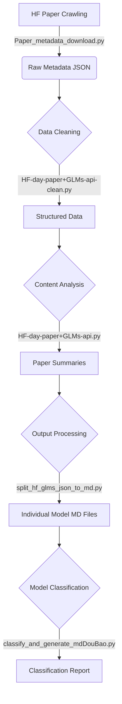

# HuggingFace Daily Papers Download and Analysis System

<div align="center">
  


</div>

<div align="center">

[English](./README.en.md) | [简体中文](./README.md)

</div>

> 🚀 **Automatically track, download, analyze, and categorize the latest AI papers and models on HuggingFace, helping you easily stay at the forefront of AI development!**

## 🌟 Project Highlights

- **Fully Automated Process**: From metadata crawling to summary generation, the entire process is automated
- **AI-Driven Analysis**: Utilizes GLM-4 and Ark large models to provide high-quality Chinese summaries and classifications
- **Batch Processing Capability**: Supports processing for single day or any date range
- **Intelligent Model Classification**: Automatically classifies models based on a knowledge base for research and application
- **Formatted Output**: Generates standardized Markdown files for easy integration into knowledge bases or blogs

## 📊 Workflow Diagram



## Project Overview

This project is a comprehensive automated tool for downloading, processing, analyzing, and categorizing the latest AI papers and models published on HuggingFace. The system supports both single-day processing and batch processing, and provides content analysis capabilities based on Zhipu AI and Ark large language models.

## ⚡ Quick Start

### Environment Setup

```bash
# Clone the repository
git clone https://github.com/ZsTs119/AI-Research-Radar.git
cd AI-Research-Radar

# Install dependencies
# Method 1: Install essential dependencies directly
pip install requests zhipuai tqdm volcenginesdkarkruntime

# Method 2: Install all dependencies using requirements.txt
pip install -r requirements.txt
```

### One-Click Run Example

```bash
# Set API keys
export ZHIPUAI_API_KEY=your_zhipu_api_key  # Linux/Mac
export ARK_API_KEY=your_ark_api_key        # Linux/Mac

# Download, process, and analyze today's papers
python Paper_metadata_download.py
python HF-day-paper+GLMs-api-clean.py
python HF-day-paper+GLMs-api.py
python split_hf_glms_json_to_md.py HF-day-paper+GLMs-api
python classify_and_generate_mdDouBao.py $(date +%Y-%m-%d) 模型分类.md
```

## Script Functions and Dependencies

### Core Data Processing Scripts

| Script Name                    | Main Function                                    | Dependencies                         |
| ------------------------------ | ------------------------------------------------ | ------------------------------------ |
| Paper_metadata_download.py     | Download daily paper metadata from HF-mirror.com | requests, json, os, sys, datetime    |
| HF-day-paper+GLMs-api-clean.py | Clean and structure raw paper data               | json, os, sys, re, datetime, zhipuai |
| HF-day-paper+GLMs-api.py       | Generate paper summaries using GLM-4 model       | json, os, sys, re, datetime, zhipuai |
| batch_paper_download.py        | Process papers for a specified date range        | os, sys, subprocess, datetime, tqdm  |

### Content Classification and Generation Scripts

| Script Name                       | Main Function                                                  | Dependencies                                         |
| --------------------------------- | -------------------------------------------------------------- | ---------------------------------------------------- |
| split_hf_glms_json_to_md.py       | Split JSON files into individual Markdown files                | os, sys, json, re                                    |
| classify_and_generate_md.py       | Classify model files for a single date based on knowledge base | os, sys, re, json, argparse                          |
| classify_and_generate_mdDouBao.py | Enhanced classification script with Ark model API support      | os, sys, re, json, argparse, volcenginesdkarkruntime |
| batch_classify_md.py              | Batch call classify_and_generate_mdDouBao.py for processing    | os, sys, re, subprocess, glob                        |

## Usage Guide

### 1. Data Download and Processing

#### Single Day Processing

```bash
# Process papers for a specific date (format: YYYY-MM-DD)
python Paper_metadata_download.py 2024-06-11

# If no date parameter is provided, automatically process the previous day's data
python Paper_metadata_download.py
```

#### Batch Processing

```bash
# Process papers for a specified date range
python batch_paper_download.py
```

### 2. JSON to Markdown Conversion

```bash
# Process a single JSON file
python split_hf_glms_json_to_md.py HF-day-paper+GLMs-api/2024-06-11_HF_glms_api_clean.json

# Process all JSON files in a directory
python split_hf_glms_json_to_md.py HF-day-paper+GLMs-api
```

### 3. Model Classification and Content Generation

> Note: You must execute the JSON splitting step above to generate individual Markdown files before performing model classification

#### Single Day Model Classification

```bash
# Process all model files in a single date directory
python classify_and_generate_mdDouBao.py 2024-06-11 模型分类.md
```

#### Batch Model Classification

```bash
# Process all date directories
python batch_classify_md.py ./ 模型分类.md

# Process only a single directory
python batch_classify_md.py 2024-06-11 模型分类.md
```

## Output File Structure

The processed files will be saved in the following structure:

1. Raw metadata: `Paper_metadata_download/YYYY-MM-DD.json`
2. Cleaned data: `HF-day-paper+GLMs-api-clean/YYYY-MM-DD_clean.json`
3. Final analysis results: `HF-day-paper+GLMs-api/YYYY-MM-DD_HF_glms_api_clean.json`
4. Individual model Markdown: `YYYY-MM-DD/model_name.md`
5. Model classification summary: `YYYY-MM-DD/模型分类汇总.md`

## System Requirements and Notes

1. **Dependency Installation**

   ```bash
   # Method 1: Install essential dependencies directly
   pip install requests zhipuai tqdm volcenginesdkarkruntime

   # Method 2: Install all dependencies using requirements.txt
   pip install -r requirements.txt
   ```

2. **API Key Configuration**

   - Zhipu AI API Key

     - Register an account and apply for an API key on the [Zhipu AI website](https://open.bigmodel.cn/)
     - The scripts `HF-day-paper+GLMs-api-clean.py` and `HF-day-paper+GLMs-api.py` require this key
     - After obtaining the key, replace it in the scripts or set an environment variable:

     ```bash
     # Windows
     set ZHIPUAI_API_KEY=your_zhipu_api_key

     # Linux/Mac
     export ZHIPUAI_API_KEY=your_zhipu_api_key
     ```

   - Ark API Key

     - Register an account and apply for an API key on the [Volcano Engine Ark Model Platform](https://www.volcengine.com/product/ark)
     - The `classify_and_generate_mdDouBao.py` script requires this key for model classification and content generation
     - Set through environment variables:

     ```bash
     # Windows
     set ARK_API_KEY=your_ark_api_key

     # Linux/Mac
     export ARK_API_KEY=your_ark_api_key
     ```

   - Environment Variable Configuration Details

     - **Windows Environment Variable Setup Methods**:

       - **Temporary Environment Variables** (valid only for the current terminal session):

         ```powershell
         # CMD Command Prompt
         set ZHIPUAI_API_KEY=your_api_key
         set ARK_API_KEY=your_api_key

         # PowerShell
         $env:ZHIPUAI_API_KEY = "your_api_key"
         $env:ARK_API_KEY = "your_api_key"
         ```

       - **Permanent Environment Variables** (remain valid after restart):

         ```powershell
         # User-level environment variables
         [Environment]::SetEnvironmentVariable("ZHIPUAI_API_KEY", "your_api_key", "User")
         [Environment]::SetEnvironmentVariable("ARK_API_KEY", "your_api_key", "User")

         # System-level environment variables (requires admin privileges)
         [Environment]::SetEnvironmentVariable("ZHIPUAI_API_KEY", "your_api_key", "Machine")
         [Environment]::SetEnvironmentVariable("ARK_API_KEY", "your_api_key", "Machine")
         ```

       - **Reading Environment Variables**:

         ```powershell
         # CMD Command Prompt
         echo %ZHIPUAI_API_KEY%

         # PowerShell
         $env:ZHIPUAI_API_KEY
         ```

     - **Linux/Mac Environment Variable Setup Methods**:

       - **Temporary Environment Variables** (valid only for the current terminal session):

         ```bash
         export ZHIPUAI_API_KEY=your_api_key
         export ARK_API_KEY=your_api_key
         ```

       - **Permanent Environment Variables** (remain valid after restart):

         ```bash
         # Add to ~/.bashrc, ~/.zshrc or ~/.profile
         echo 'export ZHIPUAI_API_KEY=your_api_key' >> ~/.bashrc
         echo 'export ARK_API_KEY=your_api_key' >> ~/.bashrc
         source ~/.bashrc  # Take effect immediately
         ```

       - **Reading Environment Variables**:
         ```bash
         echo $ZHIPUAI_API_KEY
         ```

     - **Notes**:
       - Temporary environment variables are only valid in the current terminal session and need to be reset after closing the terminal
       - Permanent environment variables are saved in system or user configuration files and remain available after restart
       - It is recommended to use permanent environment variables to avoid reconfiguring every time the project is started
       - Environment variable names are case-sensitive, make sure they match exactly with the names used in the code

3. **Processing Notes**

   - Batch processing a large number of dates may take a considerable amount of time, please be patient
   - The system will automatically skip dates with no data and mark them in the log
   - Filenames are automatically filtered for invalid characters to ensure system compatibility
   - If API rate limiting is encountered, it is recommended to appropriately extend the batch processing time interval

4. **Date Format Requirements**
   - All date inputs must strictly follow the `YYYY-MM-DD` format
   - Directory structures should also follow this naming convention

## Advanced Usage

1. **Custom Knowledge Base**: Replace the `模型分类.md` file content to customize classification rules
2. **Batch Range Control**: Modify the date range parameters in `batch_paper_download.py`
3. **API Model Selection**: Switch between different GLM model versions in the code as needed

## Troubleshooting

1. **API Call Failures**: Check API key settings and network connections
2. **Poor Content Generation Quality**: Try adjusting prompts or switching to a more advanced model
3. **Date Directory Not Created Correctly**: Ensure the system has sufficient file write permissions

## 📝 Practical Application Scenarios

- **Research Teams**: Automatically track the latest research results in the field, saving literature research time
- **AI Practitioners**: Quickly understand the characteristics and application directions of newly released models
- **Technical Bloggers**: Generate high-quality Chinese AI paper interpretation content
- **Educational Institutions**: Provide the latest research cases and model introductions for AI courses

## 🤝 Contribution Guidelines

Contributions to this project are welcome! You can participate in the following ways:

1. Submit Issues to report problems or suggest new features
2. Submit Pull Requests to improve the code
3. Improve project documentation or add use cases
4. Share your experiences and results using this project

## 📅 Project Roadmap

- [x] Basic paper crawling and processing functionality
- [x] Zhipu AI model integration
- [x] Ark large model support
- [x] Batch processing functionality
- [ ] Web interface development
- [ ] Data visualization functionality
- [ ] Multi-language support
- [ ] Docker containerized deployment

## 📜 License

This project is licensed under the MIT License, see the LICENSE file for details.

## 👨‍💻 Author

- ZsTs119
- Email: zsts@foxmail.com
- GitHub: https://github.com/ZsTs119
