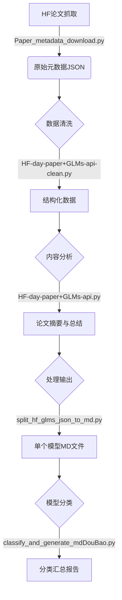

# HuggingFace 每日论文批量下载与分析系统

<div align="center">
  


</div>

<div align="center">

[English](./README.en.md) | [简体中文](./README.md)

</div>

> 🚀 **自动追踪、下载、分析和分类 HuggingFace 上的最新 AI 论文和模型，让您轻松跟上 AI 发展前沿！**

## 🌟 项目亮点

- **全自动处理流程**：从抓取元数据到生成精美摘要，全程自动化
- **AI 驱动分析**：利用智谱 GLM-4 和方舟大模型提供高质量中文摘要和分类
- **批量处理能力**：支持单日或任意日期范围的批量处理
- **模型智能分类**：基于知识库自动对模型进行分类，便于研究和应用
- **格式化输出**：生成标准化的 Markdown 文件，方便集成到知识库或博客

## 📊 工作流程图



## 项目概述

该项目是一套完整的自动化工具，用于下载、处理、分析和分类 HuggingFace 上发布的最新 AI 论文和模型。系统支持单日处理和批量处理功能，同时提供了基于智谱 AI 和方舟大模型的内容分析能力。

## ⚡ 快速开始

### 环境准备

```bash
# 克隆项目
git clone https://github.com/ZsTs119/AI-Research-Radar.git
cd AI-Research-Radar

# 安装依赖
# 方法一：直接安装必要依赖
pip install requests zhipuai tqdm volcenginesdkarkruntime

# 方法二：使用requirements.txt文件安装
pip install -r requirements.txt
```

### 一键运行示例

```bash
# 设置API密钥
export ZHIPUAI_API_KEY=your_zhipu_api_key  # Linux/Mac
export ARK_API_KEY=your_ark_api_key        # Linux/Mac

# 下载、处理并分析今天的论文
python Paper_metadata_download.py
python HF-day-paper+GLMs-api-clean.py
python HF-day-paper+GLMs-api.py
python split_hf_glms_json_to_md.py HF-day-paper+GLMs-api
python classify_and_generate_mdDouBao.py $(date +%Y-%m-%d) 模型分类.md
```

## 脚本功能与依赖

### 核心数据处理脚本

| 脚本名称                       | 主要功能                              | 依赖库                               |
| ------------------------------ | ------------------------------------- | ------------------------------------ |
| Paper_metadata_download.py     | 从 HF-mirror.com 下载每日论文元数据   | requests, json, os, sys, datetime    |
| HF-day-paper+GLMs-api-clean.py | 清洗和结构化下载的原始论文数据        | json, os, sys, re, datetime, zhipuai |
| HF-day-paper+GLMs-api.py       | 使用 GLM-4 模型生成论文摘要和内容总结 | json, os, sys, re, datetime, zhipuai |
| batch_paper_download.py        | 批量处理指定日期范围内的论文数据      | os, sys, subprocess, datetime, tqdm  |

### 内容分类与生成脚本

| 脚本名称                          | 主要功能                                            | 依赖库                                               |
| --------------------------------- | --------------------------------------------------- | ---------------------------------------------------- |
| split_hf_glms_json_to_md.py       | 将 JSON 文件切分为单独的 Markdown 文件              | os, sys, json, re                                    |
| classify_and_generate_md.py       | 基于知识库对单个日期下的模型文件进行分类            | os, sys, re, json, argparse                          |
| classify_and_generate_mdDouBao.py | 支持方舟大模型 API 的增强版分类与生成脚本           | os, sys, re, json, argparse, volcenginesdkarkruntime |
| batch_classify_md.py              | 批量调用 classify_and_generate_mdDouBao.py 进行处理 | os, sys, re, subprocess, glob                        |

## 使用指南

### 1. 数据下载与处理

#### 单日处理

```bash
# 处理特定日期的论文（格式：YYYY-MM-DD）
python Paper_metadata_download.py 2024-06-11

# 如不提供日期参数，自动处理前一天的数据
python Paper_metadata_download.py
```

#### 批量处理

```bash
# 批量处理指定日期范围内的所有论文
python batch_paper_download.py
```

### 2. JSON 切分为 Markdown

```bash
# 处理单个JSON文件
python split_hf_glms_json_to_md.py HF-day-paper+GLMs-api/2024-06-11_HF_glms_api_clean.json

# 批量处理目录下所有JSON文件
python split_hf_glms_json_to_md.py HF-day-paper+GLMs-api
```

### 3. 模型分类与内容生成

> 注意: 必须先执行上述 JSON 切分步骤，生成单独的 Markdown 文件后才能进行模型分类

#### 单日模型分类

```bash
# 处理单个日期目录下的所有模型文件
python classify_and_generate_mdDouBao.py 2024-06-11 模型分类.md
```

#### 批量模型分类

```bash
# 批量处理所有日期目录
python batch_classify_md.py ./ 模型分类.md

# 只处理单个目录
python batch_classify_md.py 2024-06-11 模型分类.md
```

## 输出文件结构

处理后的文件将按以下结构保存：

1. 原始元数据: `Paper_metadata_download/YYYY-MM-DD.json`
2. 清洗后数据: `HF-day-paper+GLMs-api-clean/YYYY-MM-DD_clean.json`
3. 最终分析结果: `HF-day-paper+GLMs-api/YYYY-MM-DD_HF_glms_api_clean.json`
4. 单个模型 Markdown: `YYYY-MM-DD/模型名称.md`
5. 模型分类总结: `YYYY-MM-DD/模型分类汇总.md`

## 系统需求与注意事项

1. **依赖安装**

   ```bash
   # 方法一：直接安装必要依赖
   pip install requests zhipuai tqdm volcenginesdkarkruntime

   # 方法二：使用requirements.txt文件安装全部依赖
   pip install -r requirements.txt
   ```

2. **API 密钥配置**

   - 智谱 AI API 密钥

     - 需要在[智谱 AI 官网](https://open.bigmodel.cn/)注册账号并申请 API 密钥
     - `HF-day-paper+GLMs-api-clean.py`和`HF-day-paper+GLMs-api.py`两个脚本需要使用此密钥
     - 申请后替换脚本中的 API 密钥或设置环境变量：

     ```bash
     # Windows
     set ZHIPUAI_API_KEY=your_zhipu_api_key

     # Linux/Mac
     export ZHIPUAI_API_KEY=your_zhipu_api_key
     ```

   - 方舟 API 密钥

     - 需要在[火山引擎方舟大模型平台](https://www.volcengine.com/product/ark)注册账号并申请 API 密钥
     - `classify_and_generate_mdDouBao.py`脚本需要使用此密钥进行模型分类与内容生成
     - 申请后通过环境变量设置：

     ```bash
     # Windows
     set ARK_API_KEY=your_ark_api_key

     # Linux/Mac
     export ARK_API_KEY=your_ark_api_key
     ```

   - 环境变量配置详解

     - **Windows 环境变量设置方法**：

       - **临时环境变量**（仅当前终端会话有效）：

         ```powershell
         # CMD 命令提示符
         set ZHIPUAI_API_KEY=your_api_key
         set ARK_API_KEY=your_api_key

         # PowerShell
         $env:ZHIPUAI_API_KEY = "your_api_key"
         $env:ARK_API_KEY = "your_api_key"
         ```

       - **永久环境变量**（重启后仍然有效）：

         ```powershell
         # 用户级环境变量
         [Environment]::SetEnvironmentVariable("ZHIPUAI_API_KEY", "your_api_key", "User")
         [Environment]::SetEnvironmentVariable("ARK_API_KEY", "your_api_key", "User")

         # 系统级环境变量（需管理员权限）
         [Environment]::SetEnvironmentVariable("ZHIPUAI_API_KEY", "your_api_key", "Machine")
         [Environment]::SetEnvironmentVariable("ARK_API_KEY", "your_api_key", "Machine")
         ```

       - **读取环境变量**：

         ```powershell
         # CMD 命令提示符
         echo %ZHIPUAI_API_KEY%

         # PowerShell
         $env:ZHIPUAI_API_KEY
         ```

     - **Linux/Mac 环境变量设置方法**：

       - **临时环境变量**（仅当前终端会话有效）：

         ```bash
         export ZHIPUAI_API_KEY=your_api_key
         export ARK_API_KEY=your_api_key
         ```

       - **永久环境变量**（重启后仍然有效）：

         ```bash
         # 在 ~/.bashrc、~/.zshrc 或 ~/.profile 文件中添加
         echo 'export ZHIPUAI_API_KEY=your_api_key' >> ~/.bashrc
         echo 'export ARK_API_KEY=your_api_key' >> ~/.bashrc
         source ~/.bashrc  # 立即生效
         ```

       - **读取环境变量**：
         ```bash
         echo $ZHIPUAI_API_KEY
         ```

     - **注意事项**：
       - 临时设置的环境变量仅在当前终端会话中有效，关闭终端后需重新设置
       - 永久设置的环境变量在系统或用户配置文件中保存，重启后仍然可用
       - 建议使用永久环境变量方式，避免每次启动项目都需要重新配置
       - 环境变量名称区分大小写，请确保与代码中使用的名称完全一致

3. **处理注意事项**

   - 批量处理大量日期可能需要较长时间，请耐心等待
   - 系统会自动跳过无数据的日期并在日志中标记
   - 文件名会自动过滤非法字符，保证系统兼容性
   - 如遇 API 限流，建议适当延长批处理时间间隔

4. **日期格式要求**
   - 所有日期输入必须严格遵循`YYYY-MM-DD`格式
   - 目录结构也应遵循此格式命名规范

## 高级用法

1. **自定义知识库**：可替换`模型分类.md`文件内容以自定义分类规则
2. **批量范围控制**：修改`batch_paper_download.py`中的日期范围参数
3. **API 模型选择**：可根据需要在代码中切换不同的 GLM 模型版本

## 常见问题排查

1. **API 调用失败**：检查 API 密钥设置和网络连接
2. **内容生成质量不佳**：尝试调整 prompt 或更换更高级的模型
3. **日期目录未正确创建**：确保系统拥有足够的文件写入权限

## 📝 实际应用场景

- **科研团队**：自动追踪领域内最新研究成果，节省文献调研时间
- **AI 从业者**：快速了解新发布模型的特点和应用方向
- **技术博主**：生成高质量的中文 AI 论文解读内容
- **教育机构**：为 AI 课程提供最新的研究案例和模型介绍

## 🤝 贡献指南

欢迎为本项目做出贡献！可以通过以下方式参与：

1. 提交 Issue 报告问题或建议新功能
2. 提交 Pull Request 改进代码
3. 完善项目文档或添加使用案例
4. 分享您使用本项目的经验和成果

## 📅 项目计划

- [x] 基础论文抓取与处理功能
- [x] 智谱 AI 模型集成
- [x] 方舟大模型支持
- [x] 批量处理功能
- [ ] Web 界面开发
- [ ] 数据可视化功能
- [ ] 多语言支持
- [ ] Docker 容器化部署

## 📜 许可证

本项目采用 MIT 许可证，详情请参见 LICENSE 文件。

## 👨‍💻 作者

- ZsTs119
- Email: zsts@foxmail.com
- GitHub: https://github.com/ZsTs119
